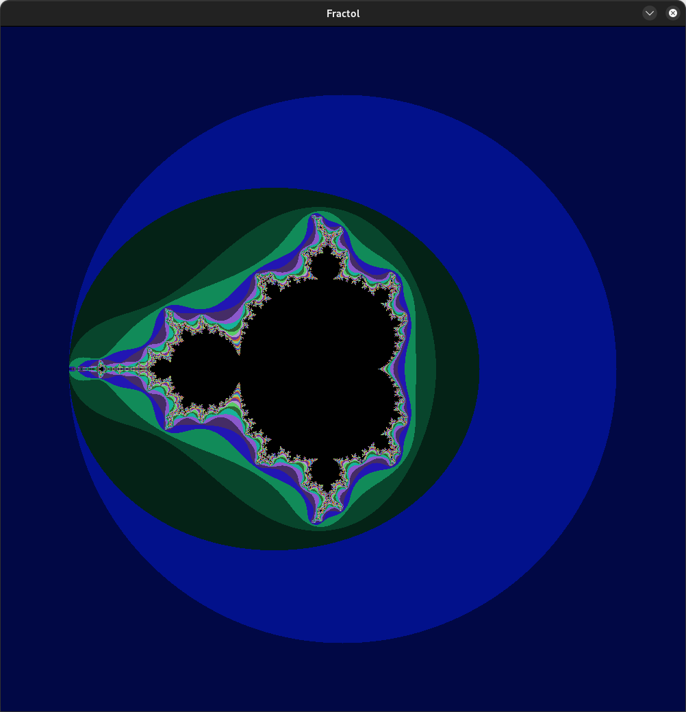
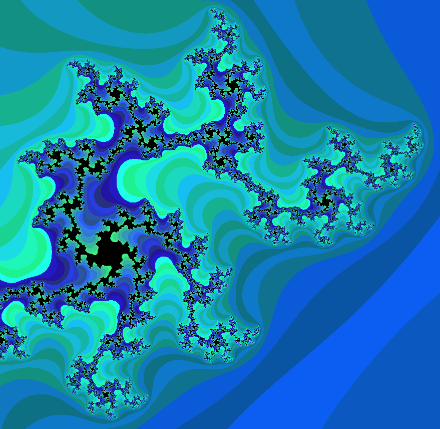
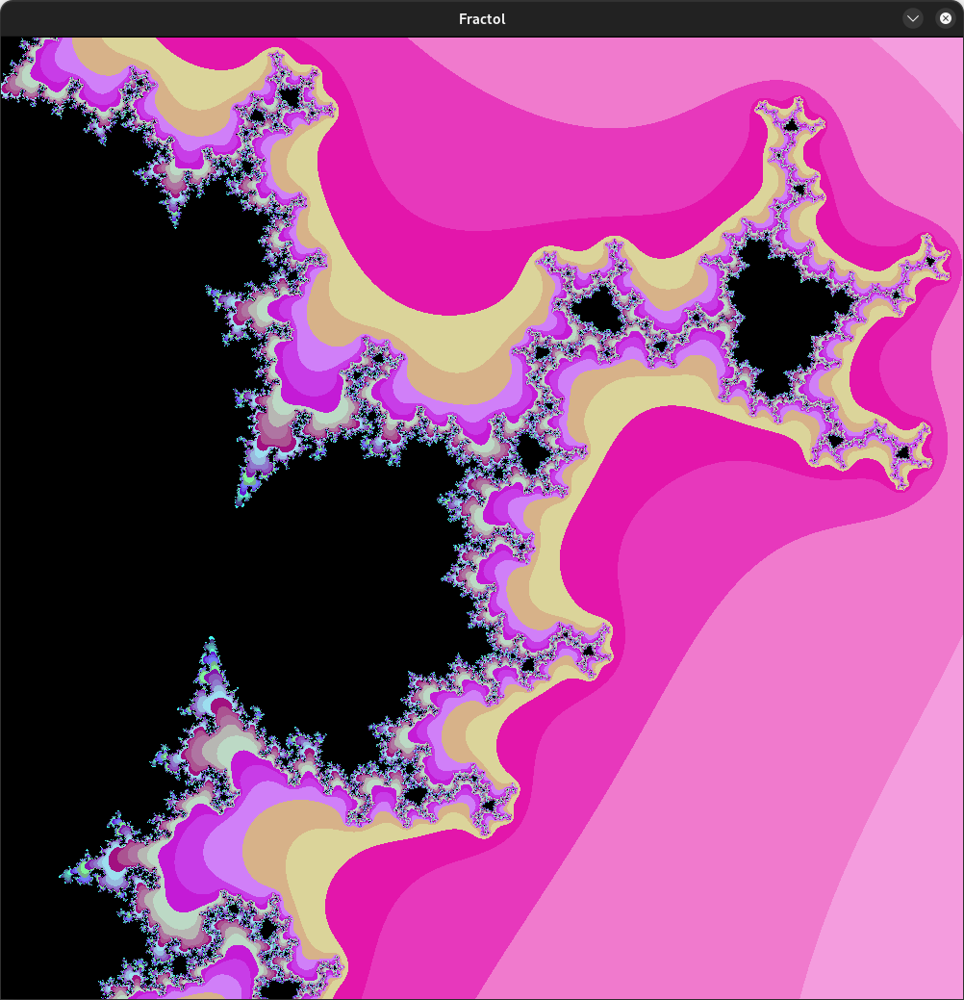
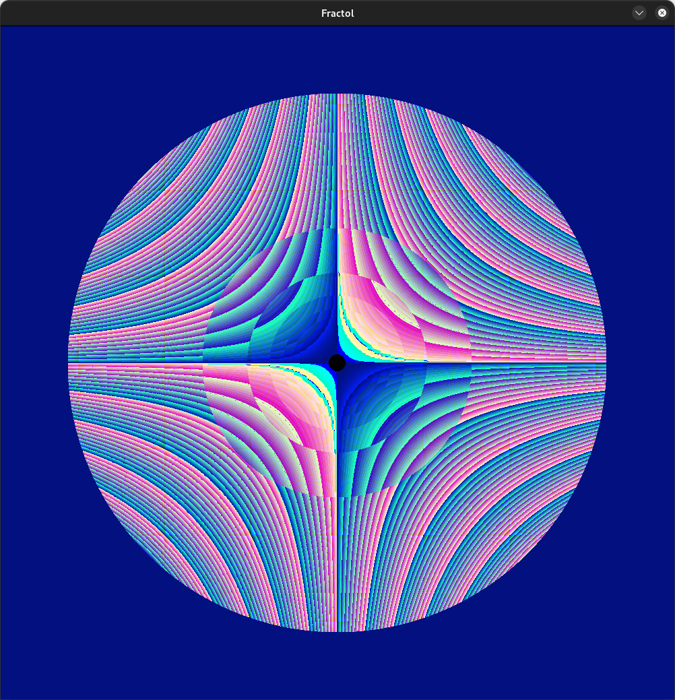
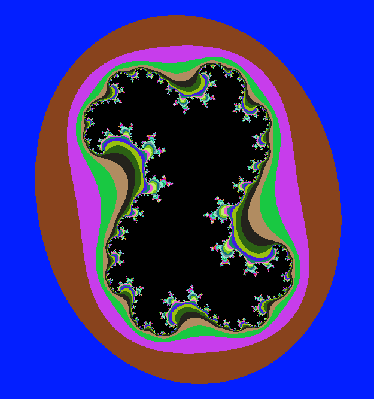
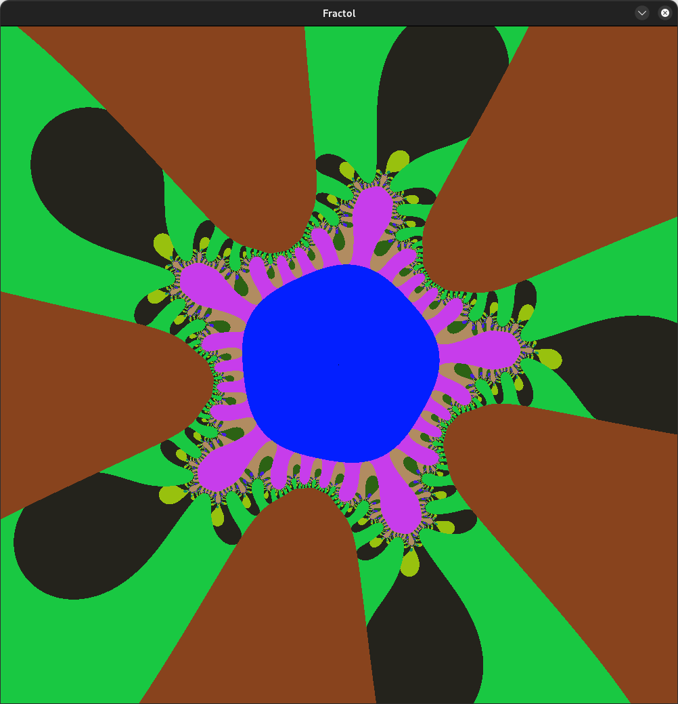
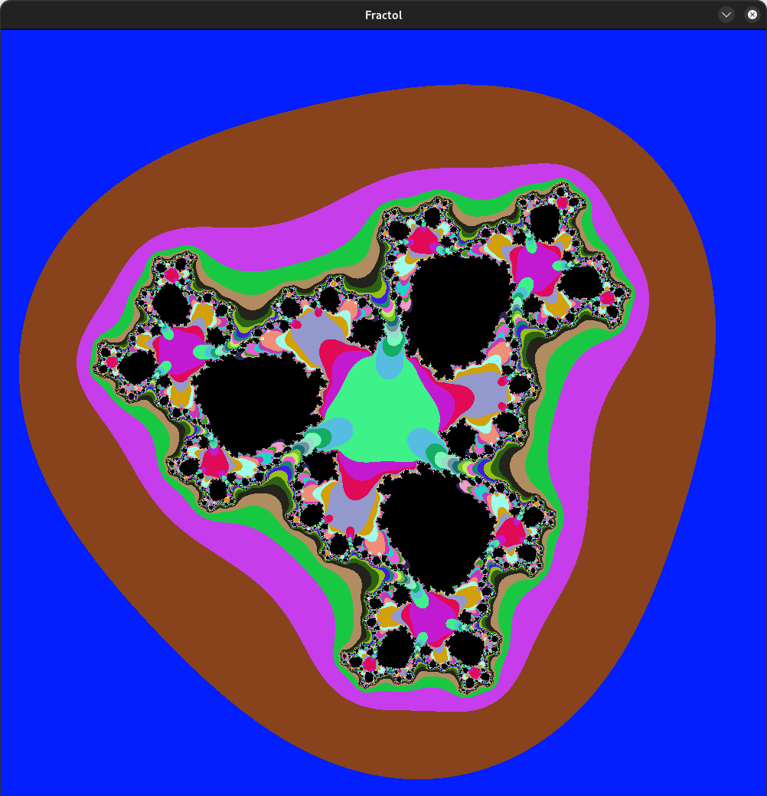
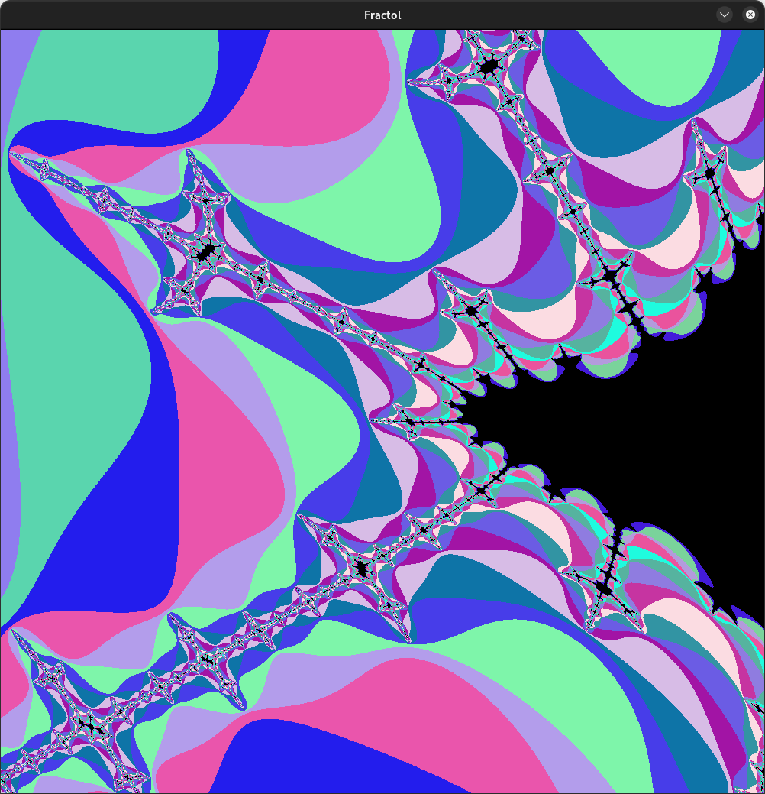

*This project has been created as part of the 42 curriculum by thtay*.

# Description
### fract'ol - Computer Graphics Fractals
Fractals, the life essence of curiousity, chaos, and creation <small>*[Citation Needed]*</small>. What more can one ask for than to explore the intricacies of life itself? Well, this project of course!  
This project aims to use the `minilibx` developed by the school to display a choice of graphic(s) of the student's choice, in which I chose `fractals`.

# Instructions
`git clone` this repository **AND** the [minilibx](https://github.com/42paris/minilibx-linux) repository into your directory and run the `make` command. Alter the makefile accordingly based on where `minilibx` is imported.

This should output a `./fractol` binary that can be executed with specific parameters.

## Execution
|`./fractol`|`{FRACTAL}`|`[OPTIONS]`|
|-|-|-|
||mandelbrot| i - initial iterations (min 1) |
||julia `{x}` `{y}`   `2 decimal args expected`| p - power of fractal formula. |
||tricorn| r - resolutionXY of the window display port. (min 1) |
||| D - Displays the working numbers that the program uses if it's (>= 1). |

**Take note that the Julia Fractal set requires an X and Y coordinate in decimal to be passed in, otherwise it will not generate.**

## Interaction
|Key(s)|Interaction|
|-|-|
|||
|**Main**   ||
|`/ (?)` `V`| Prints the `-- INTERACTION KEYBINDS --` help section. |
|`TAB`      | Toggles printing of the viewport statistics on any keypress. |
|`ESC` `Q`  | Quits the program. |
|||
|**Cycle Steps**||
|`O`            | Returns to the Origin point of the viewport. (xy 0,0) |
|`C`            | Cycles colour schemes (c0 to c5) I like c5 the best :3c.|
|`Z`            | Cycles step for the Julia fractal by *10 (MOD 9999 /10000)  (ie 100 <small>(as 0.01)</small> >> 1000 >> 1 >> 10 >> 100 >> etc)|
|`X`            | Cycles step for panning the fractal viewport by *5 (MOD 499)  (ie 20 >> 100 >> 4 >> 20 >> etc)|
|`P`            | Cycles the Power of the Fractal dependent on the Fractal. <small> `Mandelbrot`: `0 <= n <= 8` `Julia`: `-5 <= n <= 5` `Tricorn`: `n = -2`|
|||
|**Movement**||
|Arrow Keys `↑` `↓` `←` `→`| Pans around the fractal viewport in steps of `20` (default) pixels|
|`W` `A` `S` `D`           | Alters the Julia fractal in steps of `0.01` (default)|
|`= (+)` `-`               | Zooms in or out by a step of `1.25` (5/4) or `0.8` (4/5)|
|`. (>)` `, (<)`           | `+` or `-` 1 iterations to the fractal generation (Min 1)|
|||

# Resources
Perplexity AI, as always.

|Mandelbrot Set|  |
|--|--|
|[Wikipedia - Mandelbrot Set](https://en.wikipedia.org/wiki/Mandelbrot_set)| |  
|[Desmos - Mandelbrot](https://www.desmos.com/calculator/x2lwsvuqw7)|An Interactive view of how the Mandelbrot Set is graphed.|  
|[Visions of Chaos - Softology](softology.pro)|This thing right here got me in to fractals, but like with push_swap, I have yet gotten anywhere til now. Also, why did they take this off the Google Play Store :sobbing:...|  
|<small>Unfortunate yet Intentional Table Design ftw</small>||
|[Github - Mandelbrot Renderer](https://github.com/GeoffreyWang1117/Mandelbrot-Renderer)| Reference |
|[paulbourke.net - Mandelbrot Powers](https://paulbourke.net/fractals/mandelpower/)| Reference |
|[Wikipedia - Multibrot Set](https://en.wikipedia.org/wiki/Multibrot_set)| |

|Tricorn Set|  |
|--|--|
|https://fracturedcanvas.com/Tricorn.html| Reference |

|Julia Set| |
|--|--|
|[Wikipedia - Julia Set](https://en.wikipedia.org/wiki/Julia_set)| Implemented also the Multi Julia (Julian) sets |
|[Desmos - Julia Sets](https://www.desmos.com/calculator/6aelv67k2h)| |
|[Desmos - Julia Set](https://www.desmos.com/calculator/ukyivpwupd)| |

# Overview of Deliverable
## Gallery
**The image names detail the specifics of where in the set they can be found.**
### Mandelbrot

### Multibrot

### Julia
A relative to the Mandelbrot set

### Mandelbar (Tricorn)
A relative to the Mandelbrot set, just like Julia

## MODIFIED FUNCTIONS
|Function|Description|
|--|--|
|`ft_atoi_e`|Returns a 1 if there is an error in parsing, or a 0.|
|`ft_atod_e`|Same as ft_atoi_e, but also handles floats.|
|ft_printf/ft_handle_float `>>` `ft_ftoa`|Prints out a floating point number.|
